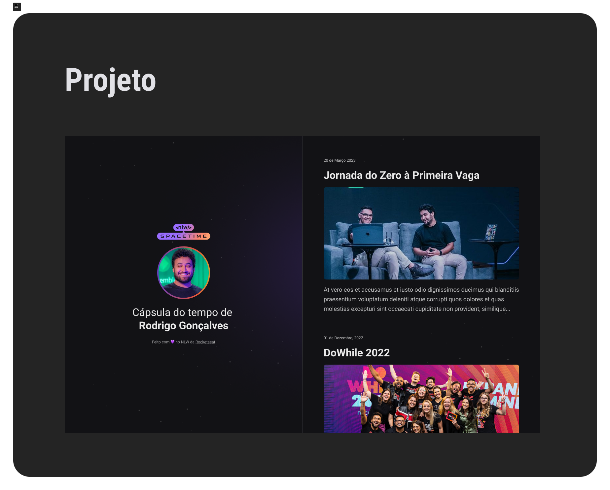

## 🖥️ projeto
Esse e um projeto web responsivo de uma cápsula do tempo para exibir memórias em uma  linha do tempo.

## 🚀tecnologias 
Esse projeto foi desenvolvido durante o NLW da Rockseat com as seguintes tecnologias:

- HTML
- CSS
- Git e Github

## 🏷️ layout
você pode visualizar o layoout do projeto através 
[desse link](https://www.figma.com/file/Vj34BKoIB1cdatg6fyRhbw/C%C3%A1psula-do-tempo-%E2%80%A2-Trilha-Explorer-(Community)-(Copy)?type=design&node-id=306%3A3&t=EhrrLJopn5q3RMvN-1).
É necessário ter uma conta no [figma](https://www.figma.com).
